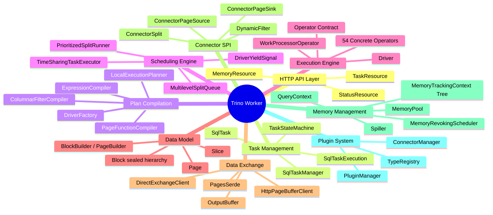

# Trino 480 Worker Module Map

## Mind Map



---

## Detailed Module Breakdown

### 1. HTTP API Layer
The worker's external surface. All coordinator communication enters here.

| Class | Role |
|-------|------|
| `TaskResource` | REST endpoints: `POST /v1/task/{taskId}` (create/update), `GET /v1/task/{taskId}/results/{bufferId}/{token}` (data pull), `DELETE /v1/task/{taskId}` (abort) |
| `StatusResource` | `GET /v1/task/{taskId}/status` — long-polling with version-based change detection |
| `MemoryResource` | `GET /v1/memory` — returns `MemoryInfo` snapshot for coordinator aggregation |
| `ThreadResource` | `GET /v1/thread` — thread dump for diagnostics |

### 2. Task Management
Lifecycle of tasks on the worker. Bridges REST requests to the execution engine.

| Class | Role |
|-------|------|
| `SqlTaskManager` | Task registry. Creates/caches `SqlTask` and `QueryContext` instances. Entry point for `updateTask()` from REST. |
| `SqlTask` | Wrapper for a single task. Holds `TaskHolder` (three-phase union: initial → running → result), `LazyOutputBuffer`, `TaskStateMachine`. |
| `SqlTaskExecution` | The active execution. Compiles plan fragment via `LocalExecutionPlanner`, creates `DriverFactory` instances, routes splits to drivers, manages pipeline lifecycle. |
| `TaskStateMachine` | 10 states: `PLANNED → RUNNING → FLUSHING → FINISHED` (happy path), with `FAILING/FAILED`, `CANCELING/CANCELED`, `ABORTING/ABORTED` for error paths. Two-phase termination ensures all drivers close before terminal state. |
| `TaskHolder` | Three-phase union type: initially holds the `TaskExecution` factory inputs, transitions to holding the live `SqlTaskExecution`, finally holds only the terminal `TaskInfo` result. |

### 3. Plan Compilation
Translates a plan fragment (from the coordinator) into executable operator pipelines. This is the glue between the distributed plan and the local execution engine.

| Class | Role |
|-------|------|
| `LocalExecutionPlanner` | Walks the `PlanNode` tree and produces a `LocalExecutionPlan` containing `DriverFactory` instances. Each plan node maps to one or more `OperatorFactory`. Handles partitioning, exchange layout, and pipeline boundaries (e.g., hash join splits into build + probe pipelines). |
| `LocalExecutionPlan` | The compiled result: a list of `DriverFactory` objects plus partition-to-driver mapping. |
| `DriverFactory` | Blueprint for creating `Driver` instances. Holds a list of `OperatorFactory` in pipeline order. Creates drivers on demand (one per split for source pipelines, fixed count for task-lifecycle pipelines). |
| `ExpressionCompiler` | Orchestrates bytecode generation for filter and projection expressions. |
| `PageFunctionCompiler` | Generates JVM bytecode for `PageProjection` and `PageFilter` using the airlift bytecode library. Row-at-a-time evaluation path. |
| `ColumnarFilterCompiler` | Generates specialized columnar filter evaluators that process entire columns at once. Used when the filter expression is simple enough for columnar evaluation. |
| `PageProcessor` | The compiled artifact: holds a filter + list of projections. Applied by `ScanFilterAndProjectOperator` with adaptive batch sizing and yield support. |

### 4. Scheduling Engine
Manages the thread pool and decides which driver runs next.

| Class | Role |
|-------|------|
| `TimeSharingTaskExecutor` | The main thread pool (`2 × CPU cores` runner threads). Pulls highest-priority `PrioritizedSplitRunner` from the queue, calls `driver.processFor(1s)`, then re-enqueues, parks, or cleans up based on result. |
| `MultilevelSplitQueue` | 5-level feedback queue (0–1s, 1–10s, 10–60s, 1–5min, 5min+). Selects the level with the worst actual-to-target time ratio. Level 0 gets 16× the CPU share of Level 4. |
| `PrioritizedSplitRunner` | Wraps a `DriverSplitRunner` with scheduling metadata: accumulated CPU time, priority level, creation timestamp. |
| `DriverSplitRunner` | Bridges `Driver.processFor()` to the executor. Handles lazy driver creation (driver instantiated on first `processFor()` call, not at enqueue time). |
| `SplitConcurrencyController` | Dynamically adjusts how many concurrent drivers a pipeline spawns based on throughput measurements. |
| `DriverYieldSignal` | A shared flag that operators cooperatively check during long-running operations (e.g., mid-projection, mid-hash-probe). Set by the executor when the 1-second quantum expires. |

### 5. Execution Engine
The actual computation. Drivers shuttle Pages through Operator chains.

| Class | Role |
|-------|------|
| `Driver` | The execution unit. Single-threaded cooperative yield loop (`processInternal()`): moves Pages between adjacent operators, checks blocked futures, respects yield signal. Never blocks a thread. |
| `DriverContext` | Per-driver stats and memory tracking. Parent of `OperatorContext` instances. |
| `Operator` (interface) | Non-blocking Volcano contract: `needsInput()`, `addInput(Page)`, `getOutput()`, `isFinished()`, `isBlocked()`. |
| `SourceOperator` | Sub-interface for operators at the start of a pipeline (no `addInput()`). Receives splits via `addSplit()`. |
| `WorkProcessorOperator` | Alternative pull-based pattern. Internally a lazy `WorkProcessor<Page>` stream. `WorkProcessorOperatorAdapter` bridges it to the push-pull `Operator` interface. |
| **54 concrete operators** | See Task 3.1.C catalog. 10 categories: source, exchange, transform, filter/project, join (build+probe), aggregation, window/ranking, sort/topN, DML/output, metadata/control. Only 4 support spilling: `HashAggregationOperator`, `OrderByOperator`, `WindowOperator`, `spilling.HashBuilderOperator`. |

### 6. Data Model
In-memory columnar representation. Passive data — no compute logic.

| Class | Role |
|-------|------|
| `Slice` | Byte substrate (airlift v2.3). Bounded view over heap `byte[]` with typed little-endian access via VarHandle. Zero-copy `slice()` shares backing array. |
| `Block` (sealed) | Column data. Three permitted types: `ValueBlock` (11 concrete: `LongArrayBlock`, `VariableWidthBlock`, etc.), `DictionaryBlock` (index indirection), `RunLengthEncodedBlock` (single value × N). |
| `Page` | Passive envelope: `Block[] blocks` + `int positionCount`. Zero-copy transforms: `getColumns()`, `prependColumn()`, `getRegion()`, `getPositions()`. |
| `BlockBuilder` | Mutable append-only builder. `build()` freezes into immutable `Block`. Auto-compresses all-null blocks to RLE. |
| `PageBuilder` | Page-level builder wrapping multiple `BlockBuilder` instances. Tracks accumulated size via `PageBuilderStatus` (1MB page limit). |

### 7. Data Exchange
Inter-worker shuffle and result delivery.

| Class | Role |
|-------|------|
| **Producer side** | |
| `OutputBuffer` (interface) | Buffer for outgoing pages. Implementations: `PartitionedOutputBuffer` (hash-partitioned, per-partition `ClientBuffer`), `BroadcastOutputBuffer` (replicate to all consumers), `ArbitraryOutputBuffer` (round-robin). |
| `LazyOutputBuffer` | Proxy that defers real buffer creation until `OutputBuffers` config arrives from coordinator. |
| `ClientBuffer` | Per-consumer FIFO queue with sequence-token-based acknowledgment. Supports long-polling via `SettableFuture`. |
| `OutputBufferMemoryManager` | Back-pressure: blocks drivers via `SettableFuture` when buffer exceeds memory limit. |
| `PagesSerde` | Serialization pipeline: 12-byte header + per-block LZ4/ZSTD compression + optional AES-CBC encryption. |
| `PartitionedOutputOperator` | Operator that hashes rows via `PagePartitioner` and enqueues serialized slices into partition-specific buffers. |
| `TaskOutputOperator` | Operator for unpartitioned output (broadcast/arbitrary). |
| **Consumer side** | |
| `ExchangeOperator` | Source operator that polls `ExchangeDataSource` for serialized pages and deserializes them. |
| `DirectExchangeClient` | Manages N `HttpPageBufferClient` instances (one per upstream task). Tracks buffer capacity, dispatches HTTP GETs when `remainingCapacity > 0`. |
| `HttpPageBufferClient` | Per-upstream HTTP client. Token-based idempotent protocol with eager acknowledgment and exponential backoff retry. |
| `StreamingDirectExchangeBuffer` | In-memory FIFO queue of received serialized pages with capacity-based back-pressure. |

### 8. Connector Interface (Storage SPI)
The boundary between the engine and external data sources/sinks.

| Class | Role |
|-------|------|
| **Read path** | |
| `ConnectorPageSource` | SPI interface: `getNextSourcePage()`, `isFinished()`, `isBlocked()`. One instance per split. |
| `ConnectorPageSourceProvider` | SPI factory: `createPageSource(split, table, columns, dynamicFilter)`. |
| `PageSourceManager` | Engine-side bridge: routes `CatalogHandle` to the correct `ConnectorPageSourceProvider`. |
| `SourcePage` | Wrapper returned by page sources. Supports lazy block loading (columns decoded on access). |
| `DynamicFilter` | Runtime predicate that narrows over query lifetime. Three application points: `ConnectorTableHandle` (planning), `PageProcessor` (engine-side), `DynamicFilter` object (connector-side). |
| **Write path** | |
| `ConnectorPageSink` | SPI interface: `appendPage()`, `finish()` → opaque fragment `Slice`s, `abort()`. |
| `ConnectorPageSinkProvider` | SPI factory for creating sinks (CTAS, INSERT, MERGE). |
| `PageSinkManager` | Engine-side bridge: routes to correct connector. |
| `TableWriterOperator` | Pushes pages into `ConnectorPageSink`. On finish, emits fragment descriptors as output page. |
| `TableFinishOperator` | Coordinator-side: collects all fragments, calls `ConnectorMetadata.finishCreateTable()`/`finishInsert()` for atomic commit. |
| **Common** | |
| `ConnectorSplit` | Opaque handle representing a unit of work (file, byte range, partition shard). |

### 9. Memory Management
Hierarchical tracking, flow control, spilling, and cluster-level arbitration.

| Class | Role |
|-------|------|
| **Pool** | |
| `MemoryPool` | Single per-node pool. `ConcurrentHashMap` tracking per-query reservations. Returns `NonCancellableMemoryFuture` when exhausted. |
| `LocalMemoryManager` | Creates the single pool at startup. Size = JVM max heap − 30% headroom. |
| **Tracking tree** | |
| `QueryContext` | Per-query isolation. Enforces `maxUserMemory` per node. Creates `MemoryTrackingContext` sub-trees for each task. |
| `MemoryTrackingContext` | Composite wrapper holding user + revocable `AggregatedMemoryContext` pairs. Factory for child contexts at each hierarchy level. |
| `RootAggregatedMemoryContext` | Tree root. Bridges to `MemoryPool` via `MemoryReservationHandler`. |
| `ChildAggregatedMemoryContext` | Intermediate tree node. Delegates delta to parent first, then records locally. |
| `SimpleLocalMemoryContext` | Leaf node. `setBytes()`/`addBytes()` compute delta and propagate up with allocation tag. |
| `CoarseGrainLocalMemoryContext` | Decorator: batches allocations to 64KB granularity (~1000× fewer pool interactions). |
| **Spilling** | |
| `MemoryRevokingScheduler` | Monitors pool (90% threshold). Traverses task tree, calls `requestMemoryRevoking()` on operators with revocable memory. Dual trigger: 1s timer + pool listener. |
| `Spiller` / `GenericSpiller` | Multi-stream spill interface. Creates one `SingleStreamSpiller` per spill call. |
| `FileSingleStreamSpiller` | Writes serialized pages to temp files with optional LZ4/ZSTD compression and AES encryption. |
| `SpillSpaceTracker` | Global per-node spill disk quota. |

### 10. Plugin System
Extensibility: loading connectors, types, and functions.

| Class | Role |
|-------|------|
| `PluginManager` | Discovers and loads SPI plugins via `ServiceLoader` with custom classloaders. |
| `ConnectorManager` | Manages connector lifecycle: create, configure, shutdown. |
| `CatalogManager` | Manages catalog registry (static + dynamic catalogs). |
| `TypeRegistry` | Type system: maps type signatures to `Type` implementations, resolves type operators, connects types to `BlockEncoding`. |
| `FunctionManager` | Function resolution and binding for built-in and plugin-provided functions. |

---

## Data Flow: How Modules Connect

```
                          ┌─────────────────────────────────────────────────────────────┐
                          │                    COORDINATOR                              │
                          │  TaskUpdateRequest(plan, splits)    GET /status (long-poll) │
                          │  GET /results/{bufferId}/{token}    GET /memory             │
                          └──────────┬──────────────────────────────────┬───────────────┘
                                     │ REST/JSON                        │
                          ┌──────────▼──────────────────────────────────▼───────────────┐
                          │                     HTTP API LAYER                          │
                          │  TaskResource    StatusResource    MemoryResource            │
                          └──────────┬──────────────────────────────────────────────────┘
                                     │
                          ┌──────────▼──────────────────────────────────────────────────┐
                          │                   TASK MANAGEMENT                           │
                          │  SqlTaskManager → SqlTask → SqlTaskExecution                │
                          │                              │                              │
                          │                    TaskStateMachine                         │
                          └──────────┬───────────────────┼──────────────────────────────┘
                                     │                   │ plan fragment
                          ┌──────────▼───────┐ ┌────────▼──────────────────────────────┐
                          │   SPLIT ROUTING  │ │        PLAN COMPILATION               │
                          │  addSplits() →   │ │  LocalExecutionPlanner                │
                          │  schedule to     │ │  PlanNode → DriverFactory[]           │
                          │  correct driver  │ │  ExpressionCompiler → PageProcessor   │
                          └──────────┬───────┘ └────────┬──────────────────────────────┘
                                     │                   │ DriverFactory[]
                          ┌──────────▼───────────────────▼──────────────────────────────┐
                          │                  SCHEDULING ENGINE                           │
                          │  TimeSharingTaskExecutor (2×CPU runner threads)              │
                          │  MultilevelSplitQueue (5 priority levels)                   │
                          │  PrioritizedSplitRunner → driver.processFor(1s)             │
                          └──────────┬──────────────────────────────────────────────────┘
                                     │ 1-second quanta
                          ┌──────────▼──────────────────────────────────────────────────┐
                          │                  EXECUTION ENGINE                            │
                          │  Driver (cooperative yield loop)                             │
                          │  ┌──────────┐   ┌──────────┐   ┌──────────┐                │
                          │  │ Source   │──▶│Transform │──▶│  Sink    │                │
                          │  │ Operator │   │ Operator │   │ Operator │                │
                          │  └────┬─────┘   └──────────┘   └────┬─────┘                │
                          │       │              ▲               │                      │
                          │       │          Page (Block[])      │                      │
                          └───────┼──────────────────────────────┼──────────────────────┘
                                  │                              │
                    ┌─────────────▼────────┐          ┌─────────▼─────────────┐
                    │   CONNECTOR SPI      │          │    DATA EXCHANGE      │
                    │  ConnectorPageSource  │          │  OutputBuffer         │
                    │  ConnectorPageSink    │          │  PagesSerde           │
                    │  DynamicFilter        │          │  DirectExchangeClient │
                    │         │             │          │         │             │
                    └─────────┼─────────────┘          └─────────┼─────────────┘
                              │                                  │
                     ┌────────▼────────┐              ┌─────────▼─────────┐
                     │  Object Store   │              │  Other Workers /  │
                     │  (S3/HDFS)      │              │  Coordinator      │
                     └─────────────────┘              └───────────────────┘

  CROSS-CUTTING:
  ┌─────────────────────────────────────────────────────────────────────────┐
  │  MEMORY MANAGEMENT                                                     │
  │  MemoryPool ← QueryContext ← TaskCtx ← PipelineCtx ← DriverCtx ←    │
  │  OperatorCtx.setBytes() → block/yield/exception                       │
  │  MemoryRevokingScheduler → Operator.startMemoryRevoke() → Spiller     │
  └─────────────────────────────────────────────────────────────────────────┘
  ┌─────────────────────────────────────────────────────────────────────────┐
  │  DATA MODEL (passive, used everywhere)                                 │
  │  Slice → Block (ValueBlock | DictionaryBlock | RLE) → Page            │
  └─────────────────────────────────────────────────────────────────────────┘
```

### Request Lifecycle (end-to-end)

1. **Coordinator** POSTs `TaskUpdateRequest` (plan fragment + initial splits) to `TaskResource`
2. **SqlTaskManager** creates `SqlTask` + `QueryContext` (or reuses cached)
3. **SqlTask** creates `SqlTaskExecution`, which calls `LocalExecutionPlanner.plan()` to compile `PlanNode` tree into `DriverFactory[]`
4. **Expression compilation** generates bytecode for filters/projections → `PageProcessor` artifacts
5. **SqlTaskExecution** creates `Driver` instances from factories, wraps them in `PrioritizedSplitRunner`, enqueues into `TimeSharingTaskExecutor`
6. **Runner thread** dequeues highest-priority split, calls `driver.processFor(1 second)`
7. **Driver** enters cooperative loop: shuttles `Page` objects between `Operator` chain
8. **Source operators** pull Pages from `ConnectorPageSource` (storage read) or `ExchangeOperator` (upstream shuffle)
9. **Transform operators** process Pages: filter, project, join, aggregate, sort, window
10. **Sink operators** push Pages into `OutputBuffer` (for downstream shuffle) or `ConnectorPageSink` (storage write)
11. Each **Operator** reports memory via `OperatorContext.setBytes()` → propagates up tracking tree → `MemoryPool`
12. If pool exhausted → operator blocks via `ListenableFuture` → driver yields → scheduler parks the split
13. If pool >90% full → `MemoryRevokingScheduler` triggers spilling → operators serialize state to disk → memory freed → blocked operators resume
14. **Downstream workers** (or coordinator) pull results via `GET /v1/task/{taskId}/results/{bufferId}/{token}` — token-based idempotent pull
15. When all drivers finish → `TaskStateMachine` transitions `RUNNING → FLUSHING → FINISHED`
16. Cleanup propagates bottom-up: Operator → Driver → Pipeline → Task → QueryContext → MemoryPool
